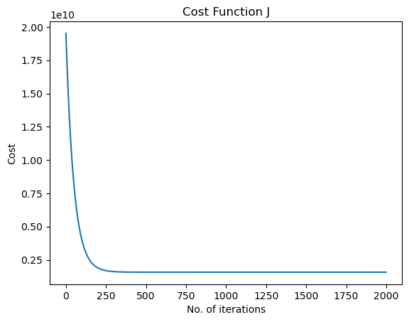
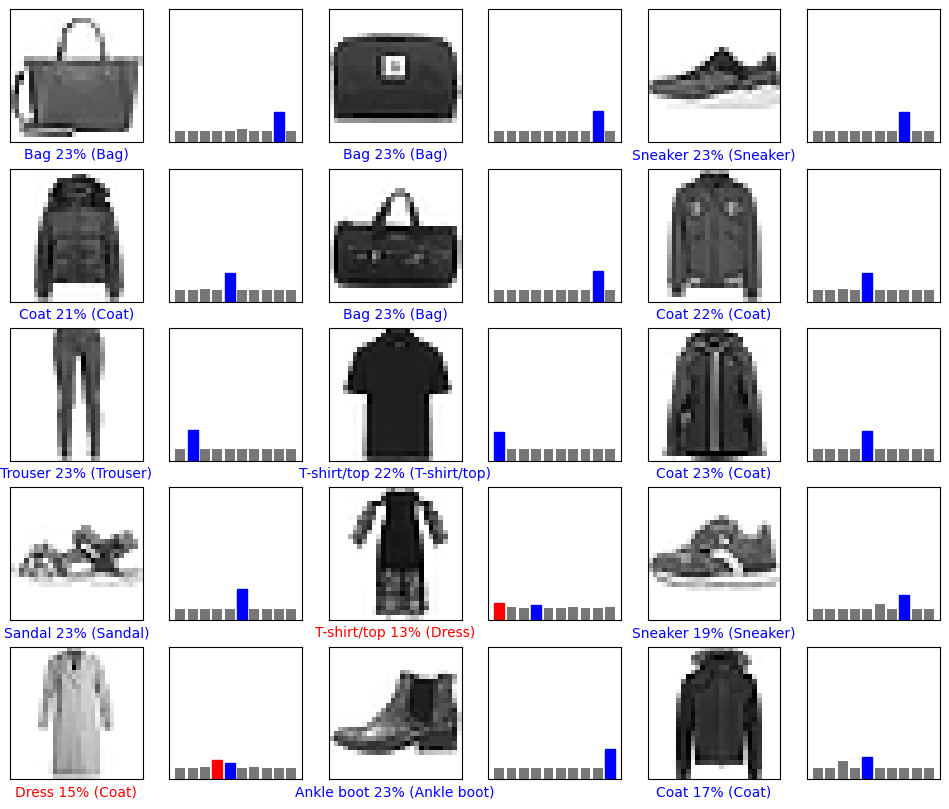
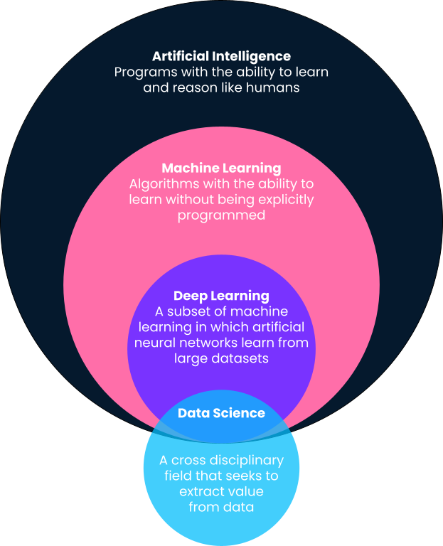
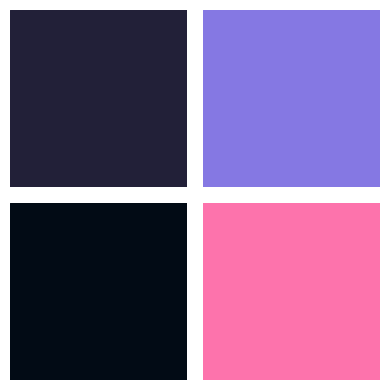
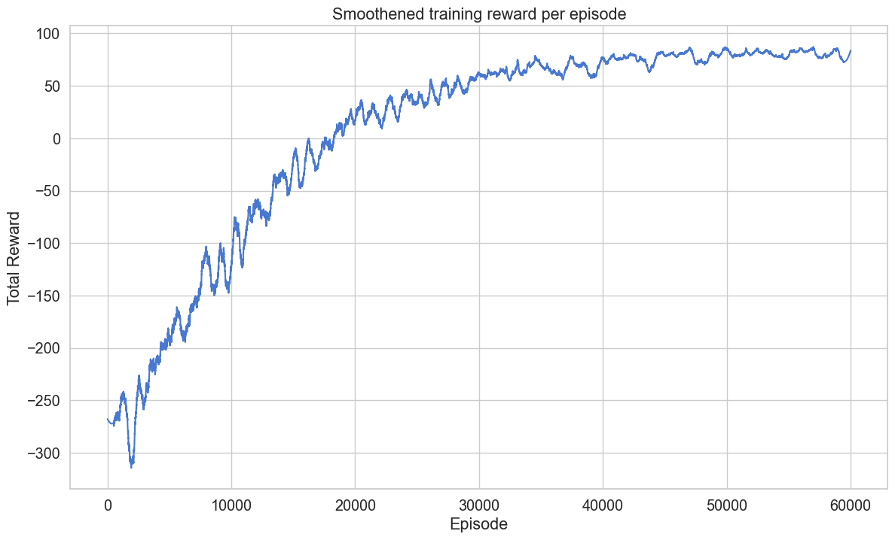
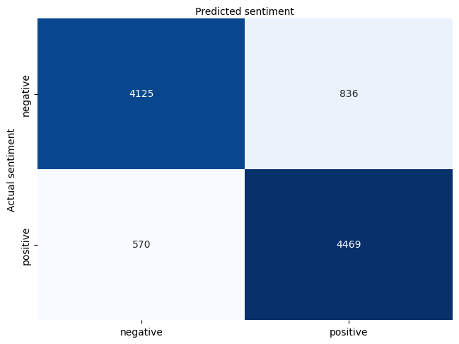

# 🧠 Machine Learning from Scratch

<div align="center">


</div>

> **"What I cannot create, I do not understand." — Richard Feynman**

Este repositório contém implementações puras em Python (via `NumPy`) de algoritmos fundamentais de Machine Learning, Deep Learning e Reinforcement Learning. O objetivo é desconstruir a "caixa preta" de bibliotecas como Scikit-Learn e PyTorch, focando na compreensão profunda da matemática, otimização e estruturas de dados subjacentes.

---

## 🎯 Objetivo
Em finanças quantitativas e pesquisa de IA, entender a derivada de uma função de custo ou a lógica de convergência de um agente é crucial. Este projeto foca em:
1.  **Vetorização:** Uso eficiente de álgebra linear para evitar loops.
2.  **Matemática Explicita:** Derivação manual de gradientes e regras de atualização.
3.  **Diversidade de Algoritmos:** Do supervisionado clássico (Regressão) ao aprendizado por reforço.

---

## 📊 Visualização & Convergência
*Resultados reais gerados pelas implementações deste repositório.*

### 1. Supervised Learning (Decision Trees)
Visualização da fronteira de decisão: o algoritmo recursivo "fatiando" o espaço de dados para classificar regiões complexas.
<div align="center">
  
</div>

### 2. Otimização Numérica (Gradient Descent)
Prova matemática de que a derivada da função de custo (Log-Loss) foi calculada corretamente, resultando em convergência suave.
<div align="center">
  
</div>

### 3. Deep Learning (Neural Networks)
Uma MLP (Multilayer Perceptron) treinada do zero classificando peças de roupa (Fashion-MNIST).
<div align="center">
  
</div>

### 4. Unsupervised Learning (K-Means)
Separação geométrica de clusters utilizando distâncias euclidianas vetorizadas.
<div align="center">
  
  
</div>

### 5. Reinforcement Learning (Q-Learning)
Evolução de um agente autônomo: a curva mostra a transição da fase de "Exploração" (ruído) para "Exploitation" (estratégia ótima).
<div align="center">
  
</div>

---

## 🛠️ Conteúdo do Repositório

### Supervised Learning
* **01 Logistic Regression:** Classificação binária com função Sigmoid e otimização via Gradient Descent (Log-Loss).
* **02 Linear Regression:** OLS (Ordinary Least Squares) e Gradient Descent para previsão contínua.
* **03 Decision Trees:** Implementação recursiva de árvores de decisão (CART/ID3) com cálculo manual de ganho de informação e impureza.

### Unsupervised Learning
* **04 K-Means Clustering:** Algoritmo de clusterização iterativo (Expectation-Maximization) implementado com distâncias vetorizadas.

### Deep Learning & NLP
* **07 Neural Networks:** Construção de uma MLP (Multilayer Perceptron) com *backpropagation* manual (regra da cadeia) e funções de ativação.
* **05 Sentiment Analysis:** Processamento de linguagem natural (NLP) básico "from scratch" para classificação de texto.

<div align="center">
  
  <p><i>Matriz de confusão para análise de sentimento</i></p>
</div>

### Applied AI Systems
* **06 Recommender System:** Motor de recomendação (Filtragem Colaborativa ou Fatoração de Matriz) sem uso de bibliotecas de "black box".
* **08 Reinforcement Learning:** Agente de aprendizado por reforço (ex: Q-Learning) navegando em um ambiente controlado via equações de Bellman.

---

## 📐 O "Motor" Matemático

Por trás do código, o foco está na derivação correta dos gradientes. Exemplo para a Regressão Logística:

A função de custo (Log-Loss):

$$
J(\theta) = - \frac{1}{m} \sum_{i=1}^{m} [y^{(i)}\log(h_\theta(x^{(i)})) + (1 - y^{(i)})\log(1 - h_\theta(x^{(i)}))]
$$

O gradiente vetorizado para atualização dos pesos:

$$
\frac{\partial J(\theta)}{\partial \theta} = \frac{1}{m} X^T (h_\theta(X) - y)
$$

---

## 🚀 Como Executar

O projeto utiliza bibliotecas mínimas (apenas `numpy` para cálculo e `matplotlib`/`pandas` para dados e plotagem).

```bash
# Clone o repositório
git clone https://github.com/cockles98/machine-learning-from-scratch.git

# Instale as dependências
pip install numpy pandas matplotlib jupyter

# Execute os notebooks
jupyter notebook
````

Abra os arquivos numerados (`01_...`, `02_...`) para ver a implementação passo-a-passo.
