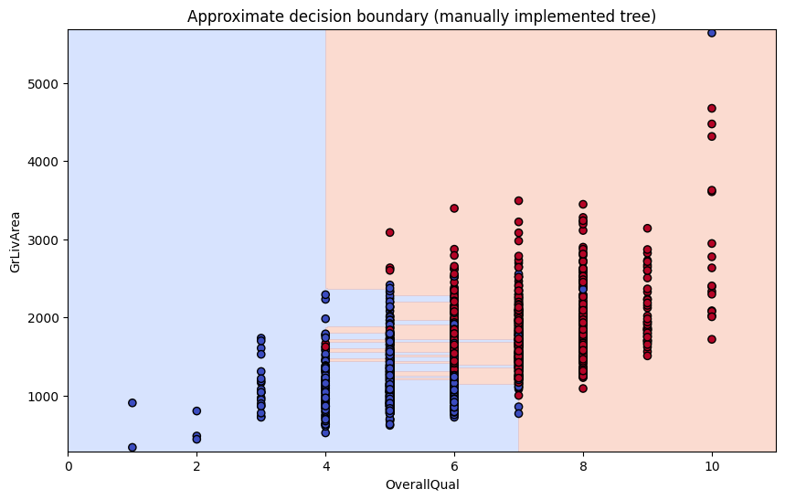

# 🧠 Machine Learning from Scratch

<div align="center">


</div>

> **"What I cannot create, I do not understand." — Richard Feynman**

Pure Python/NumPy implementations of fundamental Machine Learning, Deep Learning, and Reinforcement Learning algorithms — built without Scikit-Learn, PyTorch, or any black-box library. The goal is to understand what happens beneath the abstractions: how gradients are derived, why optimizers converge, and what the math actually looks like in code.

In quantitative finance and AI research, knowing *why* a cost function behaves a certain way — or how a Q-Learning agent converges to an optimal policy — matters as much as knowing how to call the right API. This repository is an exercise in that kind of understanding.

---

## 📊 Visualizations

### Decision Trees
Decision boundary visualization: the recursive algorithm partitioning the feature space to classify complex regions.

<div align="center">
  
</div>

### Numerical Optimization — Gradient Descent
Smooth convergence of the Log-Loss cost function, confirming that gradients were derived and implemented correctly.

<div align="center">
  
</div>

### Deep Learning — Neural Networks
A Multilayer Perceptron trained from scratch (manual backpropagation, chain rule) classifying Fashion-MNIST items.

<div align="center">
  
</div>

### K-Means
Geometric cluster separation using vectorized Euclidean distances — no loops, pure linear algebra.

<div align="center">
  
  
</div>

### Reinforcement Learning — Q-Learning
Agent reward evolution showing the transition from exploration (noisy early phase) to exploitation (stable optimal policy).

<div align="center">
  
</div>

---

## 🛠️ Repository Contents

### Supervised Learning
- **01 Logistic Regression** — Binary classification with Sigmoid activation and Gradient Descent optimization (Log-Loss)
- **02 Linear Regression** — OLS (Ordinary Least Squares) and Gradient Descent for continuous prediction
- **03 Decision Trees** — Recursive CART/ID3 implementation with manual information gain and impurity computation

### Unsupervised Learning
- **04 K-Means Clustering** — Iterative Expectation-Maximization with fully vectorized distance computation

### Deep Learning & NLP
- **05 Sentiment Analysis** — Basic NLP pipeline for text classification, built from scratch
- **07 Neural Networks** — MLP with manual backpropagation (chain rule) and configurable activation functions

<div align="center">
  
  <p><i>Confusion matrix for sentiment classification</i></p>
</div>

### Applied AI Systems
- **06 Recommender System** — Collaborative filtering / matrix factorization without black-box libraries
- **08 Reinforcement Learning** — Q-Learning agent navigating a controlled environment via Bellman equations

---

## 📐 The Mathematical Engine

The focus throughout is on deriving gradients correctly rather than relying on autodiff. Example for Logistic Regression:

Cost function (Log-Loss):

$$
J(\theta) = - \frac{1}{m} \sum_{i=1}^{m} [y^{(i)}\log(h_\theta(x^{(i)})) + (1 - y^{(i)})\log(1 - h_\theta(x^{(i)}))]
$$

Vectorized gradient for weight update:

$$
\frac{\partial J(\theta)}{\partial \theta} = \frac{1}{m} X^T (h_\theta(X) - y)
$$

---

## 🚀 Getting Started

Minimal dependencies — only `numpy` for computation and `matplotlib`/`pandas` for data and plotting.

```bash
# Clone the repository
git clone https://github.com/cockles98/machine-learning-from-scratch.git

# Install dependencies
pip install numpy pandas matplotlib jupyter

# Run the notebooks
jupyter notebook
```

Open the numbered files (`01_...`, `02_...`) to follow each implementation step by step.
